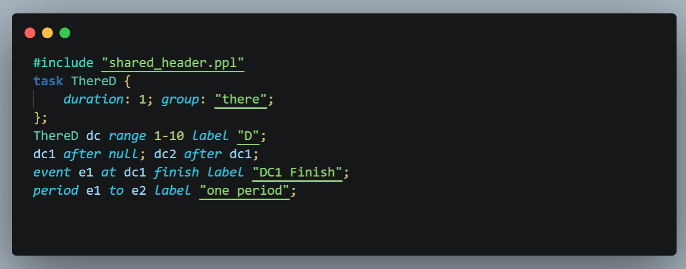
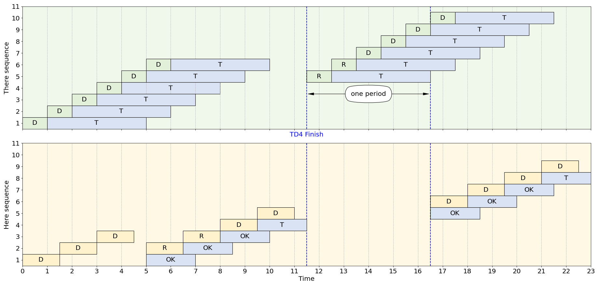

# Pipeline Analyzer

Pipeline analyzer includes a portable DSL parser based on `pyparsing` and a figure drawer based on `matplotlib`.

## Pipeline Grammar
### Keywords

| Keyword  	| Description                                 	| Keyword 	| Description                               	|
|----------	|---------------------------------------------	|---------	|-------------------------------------------	|
| task     	| Declare a task class                        	| event   	| define a event                            	|
| duration 	| specify the time of duration of a task      	| at      	| specify the time when a event happens     	|
| group    	| specify the goup of a task                  	| finish  	| denote the finish time of a task          	|
| after    	| define a dependency relationship            	| start   	| denote the start time of a task           	|
| range    	| specify the subscript range of task objects 	| period  	| define a period                           	|
| null     	| a placeholder referring to no task object   	| to      	| specify the beginning and end of a period 	|
| label    	| specify a description                       	| include 	| prepocessor to include another ppl file   	|

### Task Class Declaration

```ocaml
task <TaskClassName> {
    duration: <FloatNumber>; group: "<String>";
};
```
`<TaskClassName>` consists of letters and "_".
### Task Object Definition

```ocaml
<TaskClassName> <TaskObjectName> range <Integer>-<Integer>;

<TaskClassName> <TaskObjectName> range <Integer>-<Integer> label "<String>";
```
`<TaskObjectName>` consists of letters and "_". The label is an empty `<String>` by default.
### Dependency Definition

```ocaml
<TaskRefName> after <TaskRefName>;
<TaskRefName> after <TaskRefName> <TaskRefName>;
...
```
TaskRefName consists of a `<TaskObjectName>` followed by an `<Integer>` within the defined subscript range, e.g., task1.

### Event Definition
```ocaml
event <EventName> at <TaskObjectName> start;
event <EventName> at <TaskObjectName> finish label "<String>";
```
`<EventName>` consists of letters, numbers and "_".

### Period Definition
```ocaml
period <EventName> to <EventName>;
period <EventName> to <EventName> label "<String>";
```
### Comment

```javascript
// Some comments
```

### Other Rules
Pipeline is sensitive to capitalization and insensitive to line break between words. `;` is expected in the end to close each expression.

## Install the Highlighter Extension for VSCode

In the following tutorial, we use `Command("command")` to represent searching and running the command `<command>` in VSCode Command Palette. Usually, you can open the palette by shotcut keys `Shift + Command + P` in MacOS and `Ctrl + Shift + P` in Windows/Linux.
1. Clone or download this repository.
2. Command("Extensions: Open Extensions Folder") -> Copy the directry `pipeline.vscode` to the extensions folder -> Command("Developer: Reload Window")
3. Command("Preferences: Open User Settings (JSON)") -> Copy JSON settings in `pipeline.vscode/settings.json` (starting from Line 2) and insert them into the VSCode's user settings.

### Highlight Example


## Example of Usage

We provide an example of usage in `example.py` with dependency definitions in `example.ppl`/`example_h.ppl` and output figure `example.png`.

```python
from pipeline.pipeline_parser import PipelineParser
from pipeline.pipeline_drawer import DiagramDrawer


parser = PipelineParser()
parsed = parser.parse_file("example.ppl")

tasks = parsed.arange_tasks()
events = parsed.compute_events()
period = parsed.compute_period()
groups = { 'here': 1, 'there': 0 }
colors = {
    'ThereD': '#E2F0D9', 'HereD': '#FFF2CC',
    'ThereT': '#DAE3F3', 'HereT': '#DAE3F3',
    'here': '#FFF8E5', 'there': '#F0F7EB' }

figure = DiagramDrawer(
        max_ylim=11, ylabel="sequence"
    ).draw(tasks, events, period, groups, colors)
figure.savefig('example.png')
```

